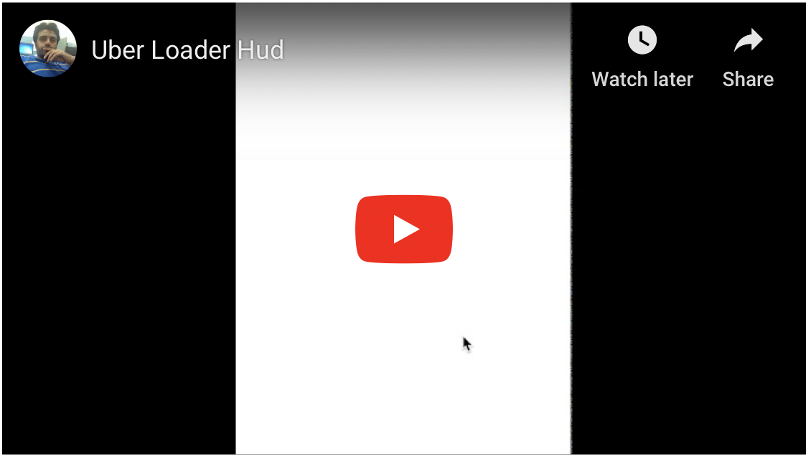

# UberLoaderHud

UberLoaderHud is simple implementation of Uber Style loading indicator. 

UIView extention easy to use 

To show hud in any view  `self.view.showLinearHud()`

To hide hud in view `self.view.hideLinearHud()`

Add top padding in case of under navigation bar 

`self.view.showLinearHud(Double(self.view.safeAreaInsets.top))`

#Color & Height

Change color with UIView static property 

`UIView.loaderColor = UIColor.red`

Change line height

`UIView.loaderHeight = 4.0`

#Installation 

Install Using pods

`pod 'UberLoaderHud'`

Version 1.0